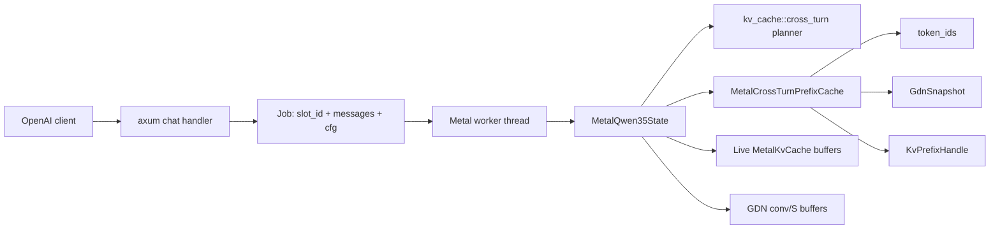
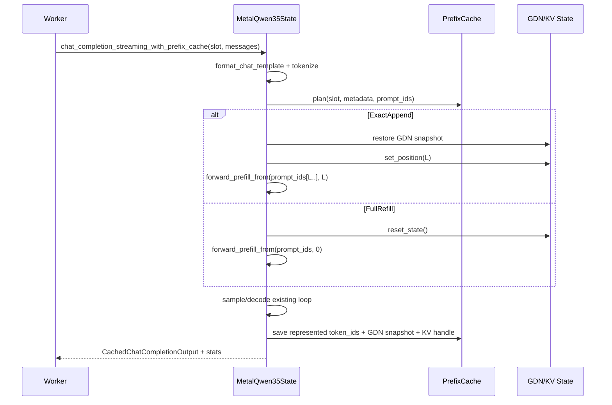

# Design: Cross-Turn KV Prefix Cache for Lattice #462

Date: 2026-07-01
Role: architect, op 4, team `lattice_kv_462`
Status: shipped design (round-2 remediation, 2026-07-01). Interfaces below reflect the runtime shape as merged, not the original per-slot proposal (see "Round-2 remediation" note below).
Inputs: `../analyst/design_brief.md`, direct code scan of `/Users/lion/projects/khive/lattice-kvcache-462`.

Tooling note: `li team receive -t 2d5c82e54e73 --as architect` failed because `li` is not installed. Fallback `comm.inbox()` via khive returned count 0.

## Executive Decision

Implement a worker-local cross-turn prefix cache for the Metal Qwen3.5 serve/chat path. The cache reuses only an exact token prefix that is already represented by all mutable model state:

- rendered prompt token IDs,
- live Metal full-attention KV buffers plus logical `seq_len`,
- `InferenceSession.position`,
- one exact `GdnSnapshot` at the same boundary.

For v1, optimize append-only growing conversations where `L == cached.represented_len`. On mid-history divergence where `L < cached.represented_len`, fall back to full reset/full prefill unless the implementer also adds sparse GDN checkpoints and replay. Attention-KV-only reuse is forbidden for Qwen3.5 because 18 of 24 layers are GatedDeltaNet recurrent layers.

Token-identity invariant:

> For the same rendered conversation, tokenizer, model weights/config, adapter state, generation config, random seed, and stop handling, the cached path must produce exactly the same generated token IDs as the existing full-reset/full-refill path.

This design preserves the invariant by requiring token-level prefix equality, restoring GDN state at the same boundary as the reused KV prefix, using absolute positions for suffix prefill, and falling back whenever any state boundary is unavailable or ambiguous.

## Existing Architecture Anchors

- `lattice_serve` owns one `!Send` `MetalQwen35State` on a dedicated worker thread and serializes `Job`s over `tokio::sync::mpsc` (`crates/inference/src/bin/lattice_serve.rs`).
- Current serve reset: `metal.reset_state()` before every worker job at `lattice_serve.rs:232`.
- Current chat/REPL reset: `chat_metal.rs:758` and `chat_metal.rs:824`.
- `chat_completion_streaming` renders ChatML via `format_chat_template`, adds `<|im_end|>`, then calls `generate_streaming` (`metal_qwen35.rs:15082`-`15102`).
- `generate_streaming` tokenizes into `prompt_ids`, then unconditionally calls `self.reset_state()` before full prefill (`metal_qwen35.rs:13707`-`13756`).
- `forward_prefill_batched_chunk(token_ids, start_pos, all_positions)` already accepts absolute `start_pos` and writes KV/RoPE rows at that absolute position.
- `forward_prefill_impl` is not directly reusable for suffix prefill because its public wrapper starts at zero and its single-token path calls `forward_step(token, 0)`.
- Existing generic prefix cache patterns live under `crates/inference/src/kv_cache/prefix.rs` and are re-exported through `kv_cache/mod.rs`.
- Existing GDN snapshot type is `crate::attention::gdn::GdnSnapshot = Vec<(Vec<f32>, Vec<f32>)>`.
- Existing error variant `InferenceError::PrefixCache(String)` should be used for recoverable cache planning/restore failures.

## Module Placement

Follow existing crate boundaries:

1. Add generic token-prefix planning in `crates/inference/src/kv_cache/cross_turn.rs`.
   - This mirrors `kv_cache/prefix.rs`: small structs, deterministic planning, unit tests.
   - It must not depend on `metal::*` buffers.
   - Re-export from `crates/inference/src/kv_cache/mod.rs`.

2. Add Metal-specific cache ownership inside `crates/inference/src/forward/metal_qwen35.rs`.
   - `MetalQwen35State` already owns live `MetalKvCache`, GDN buffers, tokenizer-facing streaming, and private GDN snapshot/restore methods.
   - The cross-turn entry stores logical KV ownership and one `GdnSnapshot`; actual K/V `Buffer`s remain in `self.session.kv_cache`.

3. Update only serve/chat call sites for feature use.
   - `lattice_serve.rs` should use the cache-aware chat method and remove its unconditional pre-job `reset_state()`.
   - `chat_metal.rs` REPL can use the cache-aware method for the growing local `history`; JSON one-shot and stateless paths may keep full reset.

Do not introduce a new service abstraction or shared database of cache state. The current worker is single-threaded around Metal, so worker-local state has lower coupling and clearer ownership.

## Committed Rust Interfaces

### Generic Planning Module

File: `crates/inference/src/kv_cache/cross_turn.rs`

```rust
use crate::kv_cache::AdapterId;

#[derive(Debug, Clone, Copy, PartialEq, Eq, Hash)]
pub struct CrossTurnSlotId(pub u64);

impl CrossTurnSlotId {
    pub const DEFAULT: Self = Self(0);
    pub const fn new(value: u64) -> Self;
}

#[derive(Debug, Clone, PartialEq, Eq, Hash)]
pub struct CrossTurnPrefixMetadata {
    pub model_fingerprint: u64,
    pub tokenizer_fingerprint: u64,
    pub adapter_id: AdapterId,
    pub vocab_size: usize,
    pub max_cache_len: usize,
    pub kv_f16: bool,
    pub rope_theta_bits: u64,
    pub partial_rotary_factor_bits: Option<u32>,
    pub layer_pattern_hash: u64,
    pub chat_template_version: u32,
}

#[derive(Debug, Clone, Copy, PartialEq, Eq)]
pub struct KvPrefixHandle {
    pub represented_len: usize,
    pub num_full_attention_layers: usize,
    pub kv_dim: usize,
    pub max_cache_len: usize,
    pub kv_f16: bool,
}

#[derive(Debug, Clone, PartialEq, Eq)]
pub struct CrossTurnPrefixEntry {
    pub slot_id: CrossTurnSlotId,
    pub metadata: CrossTurnPrefixMetadata,
    pub token_ids: Vec<u32>,
    pub represented_len: usize,
    pub kv: KvPrefixHandle,
    pub gdn_snapshot_len: usize,
}

#[derive(Debug, Clone, Copy, PartialEq, Eq)]
pub enum PrefixReuseMode {
    FullRefill,
    ExactAppend,
    ReplayFromCheckpoint { checkpoint_len: usize },
}

#[derive(Debug, Clone, PartialEq, Eq)]
pub struct PrefixRestorePlan {
    pub mode: PrefixReuseMode,
    pub shared_token_prefix_len: usize,
    pub reusable_len: usize,
    pub suffix_start: usize,
    pub suffix_len: usize,
    pub old_represented_len: usize,
}

pub fn longest_common_token_prefix(a: &[u32], b: &[u32]) -> usize;

pub fn plan_prefix_reuse(
    entry: Option<&CrossTurnPrefixEntry>,
    metadata: &CrossTurnPrefixMetadata,
    new_prompt_ids: &[u32],
    sparse_checkpoint_lens: &[usize],
) -> PrefixRestorePlan;
```

Rules for `plan_prefix_reuse`:

- Return `FullRefill` when no entry exists, metadata differs, `new_prompt_ids` is empty, or `shared_token_prefix_len == 0`.
- Return `ExactAppend` only when `shared_token_prefix_len == entry.represented_len` and `entry.gdn_snapshot_len == entry.represented_len`.
- Return `ReplayFromCheckpoint { checkpoint_len }` only if `checkpoint_len <= shared_token_prefix_len` and an implementation actually owns an exact GDN checkpoint at `checkpoint_len`.
- Otherwise return `FullRefill`.

### Metal-Specific Runtime Types

File: `crates/inference/src/forward/metal_qwen35.rs`, inside the existing `inner` module near `MetalKvCache` / `InferenceSession`.

```rust
use crate::attention::gdn::GdnSnapshot;
use crate::error::InferenceError;
use crate::kv_cache::{
    CrossTurnPrefixEntry, CrossTurnPrefixMetadata, CrossTurnSlotId, KvPrefixHandle,
    PrefixRestorePlan, PrefixReuseMode,
};

#[derive(Debug, Clone)]
pub struct CrossTurnCacheStats {
    pub slot_id: CrossTurnSlotId,
    pub prompt_tokens: usize,
    pub reused_tokens: usize,
    pub prefetched_tokens: usize,
    pub mode: PrefixReuseMode,
}

#[derive(Debug, Clone)]
pub struct CachedGenerateOutput {
    pub output: GenerateOutput,
    pub cache: CrossTurnCacheStats,
}

#[derive(Debug, Clone)]
pub struct CachedChatCompletionOutput {
    pub output: ChatCompletionOutput,
    pub cache: CrossTurnCacheStats,
}

#[derive(Debug, Clone)]
struct MetalCrossTurnPrefixEntry {
    generic: CrossTurnPrefixEntry,
    gdn_snapshot: GdnSnapshot,
}

#[derive(Debug, Default)]
struct MetalCrossTurnPrefixCache {
    entry: Option<MetalCrossTurnPrefixEntry>,
}

impl MetalCrossTurnPrefixCache {
    fn get(&self, slot_id: CrossTurnSlotId) -> Option<&MetalCrossTurnPrefixEntry>;
    fn insert(&mut self, entry: MetalCrossTurnPrefixEntry);
    fn take(&mut self, slot_id: CrossTurnSlotId) -> Option<MetalCrossTurnPrefixEntry>;
    fn remove(&mut self, slot_id: CrossTurnSlotId);
    fn clear(&mut self);
}
```

**Round-2 remediation (as shipped, differs from the design above):** the runtime
shape is `entry: Option<MetalCrossTurnPrefixEntry>` — a single live entry per
`MetalQwen35State`, **not** a `HashMap<CrossTurnSlotId, _>`. `get`/`take`/`remove`
all filter by `slot_id` against that one entry (a different or absent slot is
always a miss). `insert` unconditionally **replaces** whatever is currently
retained, for any slot — saving a new entry for slot B silently evicts slot A's
entry. This is a deliberate, bounded-by-construction design (never an unbounded
per-slot map): at most one ~19.3 MiB GDN snapshot is ever alive, at the cost of
zero retention across concurrent multi-slot traffic on the same `MetalQwen35State`
(single-slot-at-a-time is the actual v1 contract; see "Round-2 remediation" note
under "What The Cache Retains" below). The original per-slot `HashMap` sketch
above was rejected in round-2 remediation because it was the source of the
round-1/round-2 unsoundness findings (stale per-slot entries surviving live
state mutation that the map had no way to observe).

Extend `MetalQwen35State`:

```rust
pub struct MetalQwen35State {
    pub(crate) engine: MetalQwen35Engine,
    pub(crate) session: InferenceSession,
    pub(crate) lora: Option<MetalLoraAdapter>,
    pub(crate) use_gdn_chunked: bool,
    pub(crate) use_kv_f16: bool,
    cross_turn_prefix_cache: MetalCrossTurnPrefixCache,
}
```

Public cache-aware methods:

```rust
impl MetalQwen35State {
    pub fn clear_cross_turn_prefix_cache(&mut self);

    pub fn generate_streaming_with_prefix_cache<F>(
        &mut self,
        slot_id: CrossTurnSlotId,
        prompt: &str,
        tokenizer: &BpeTokenizer,
        gen_cfg: &GenerateConfig,
        on_token: F,
    ) -> Result<CachedGenerateOutput, InferenceError>
    where
        F: FnMut(&str, u32) -> bool;

    pub fn chat_completion_streaming_with_prefix_cache<F>(
        &mut self,
        slot_id: CrossTurnSlotId,
        messages: &[ChatMessage],
        tokenizer: &BpeTokenizer,
        gen_cfg: &GenerateConfig,
        on_token: F,
    ) -> Result<CachedChatCompletionOutput, InferenceError>
    where
        F: FnMut(&str, u32) -> bool;
}
```

Private helper signatures:

```rust
impl MetalQwen35State {
    fn cross_turn_metadata(&self, tokenizer: &BpeTokenizer) -> CrossTurnPrefixMetadata;

    fn plan_cross_turn_reuse(
        &self,
        slot_id: CrossTurnSlotId,
        metadata: &CrossTurnPrefixMetadata,
        prompt_ids: &[u32],
    ) -> PrefixRestorePlan;

    fn restore_cross_turn_prefix(
        &mut self,
        slot_id: CrossTurnSlotId,
        plan: &PrefixRestorePlan,
    ) -> Result<(), InferenceError>;

    fn forward_prefill_from(
        &mut self,
        token_ids: &[u32],
        start_pos: usize,
        all_positions: bool,
    ) -> Result<Vec<f32>, InferenceError>;

    fn save_cross_turn_prefix(
        &mut self,
        slot_id: CrossTurnSlotId,
        metadata: CrossTurnPrefixMetadata,
        represented_token_ids: Vec<u32>,
    ) -> Result<(), InferenceError>;

    fn snapshot_gdn_states_checked(&self) -> Result<GdnSnapshot, InferenceError>;

    fn restore_gdn_states_checked(&mut self, snapshot: &GdnSnapshot) -> Result<(), InferenceError>;
}
```

`snapshot_gdn_states_checked` and `restore_gdn_states_checked` wrap the existing private snapshot/restore logic and convert shape mismatches to `InferenceError::PrefixCache` instead of relying on `debug_assert_eq!`.

## What The Cache Retains

**Round-2 remediation (as shipped):** at most ONE entry is retained per
`MetalQwen35State`, not one per `CrossTurnSlotId`. The fields below describe
that single retained entry when present; it is tagged with the `slot_id` it
was saved for, and `get`/`take`/`remove` filter on that tag, but saving a new
entry for a different slot unconditionally evicts whatever was retained
before, regardless of slot. The "Per `CrossTurnSlotId`" framing in the
original design (below) described the rejected multi-slot `HashMap` shape:

- `token_ids: Vec<u32>`: exact rendered prompt tokens represented by state.
- `represented_len: usize`: authoritative number of tokens in all reusable state.
- `kv: KvPrefixHandle`: logical handle to live `self.session.kv_cache` buffers, not a copy. The actual Metal `k_bufs` and `v_bufs` remain owned by the same `MetalQwen35State`.
- `gdn_snapshot: GdnSnapshot`: exact recurrent `S` matrices and conv buffers after `represented_len` tokens.
- `metadata: CrossTurnPrefixMetadata`: invalidates across model/tokenizer/adapter/RoPE/KV layout/template changes.

The v1 cache must not store every token-boundary GDN snapshot. One exact latest-boundary snapshot is enough for normal append-only chat and costs about 19.3 MiB for Qwen3.5-0.8B. Every-token GDN snapshots are rejected for v1 because they are about 19.3 MiB per boundary.

## Serve/Chat Hook

**Round-2 remediation (status, 2026-07-01): DEFERRED, not implemented in this PR.**
Everything in this section — the `Job.slot_id` extension, `request_slot_id`, the
worker loop replacement, and the `chat_metal.rs` REPL/JSON-mode wiring — is design
intent for a follow-up PR (D6), not a shipped component of #516. This PR ships only
the correctness substrate: `MetalCrossTurnPrefixCache`,
`generate_streaming_with_prefix_cache`, `chat_completion_streaming_with_prefix_cache`,
and the round-2 raw-forward invalidation boundary. `lattice_serve.rs` and
`chat_metal.rs` do not currently call any `*_with_prefix_cache` entry point, so
neither the serve worker nor the chat REPL opt into cross-turn reuse yet — they
continue to use `reset_state()`/`generate_streaming` exactly as before this PR.

### `lattice_serve.rs`

Extend `Job`:

```rust
struct Job {
    slot_id: CrossTurnSlotId,
    messages: Vec<ChatMessage>,
    cfg: GenerateConfig,
    tx: mpsc::UnboundedSender<Ev>,
}
```

Add request-derived slot selection:

```rust
fn request_slot_id(req: &ChatReq) -> CrossTurnSlotId;
```

Recommended v1 behavior:

- If a request includes a client-supplied cache/session key, hash it into `CrossTurnSlotId`.
- If no key exists, use `CrossTurnSlotId::DEFAULT` only when the server is configured for single-client local use; otherwise disable cross-turn caching for that request by using full reset. This avoids cross-client state bleed.

Worker loop replacement:

```rust
while let Some(job) = job_rx.blocking_recv() {
    let cb_tx = job.tx.clone();
    let result = metal.chat_completion_streaming_with_prefix_cache(
        job.slot_id,
        &job.messages,
        &tokenizer,
        &job.cfg,
        |delta, _id| cb_tx.send(Ev::Delta(delta.to_string())).is_ok(),
    );

    match result {
        Ok(out) => {
            let _ = job.tx.send(Ev::Done {
                prompt_tokens: out.output.prompt_tokens,
                completion_tokens: out.output.completion_tokens,
            });
        }
        Err(err) => {
            metal.reset_state();
            metal.clear_cross_turn_prefix_cache();
            let _ = job.tx.send(Ev::Error(err.to_string()));
        }
    }
}
```

`Ev::Error(String)` is an added worker event so cache setup failures do not panic or silently hang the client.

### `chat_metal.rs`

- REPL mode: replace the per-turn `metal.reset_state()` with `chat_completion_streaming_with_prefix_cache(CrossTurnSlotId::DEFAULT, ...)`.
- JSON serve mode: add the same slot-key rule as `lattice_serve` or keep full reset if no request-level session identity exists.
- One-shot mode: no cache is needed; keep existing behavior.

## Generation Algorithm

1. Format/render prompt exactly as existing code does.
   - Chat path still uses `format_chat_template(messages)`.
   - `generate_streaming_with_prefix_cache` starts from the prompt string and tokenizer.

2. Tokenize once:

```rust
let input = tokenizer.tokenize(prompt);
let prompt_ids: Vec<u32> = input.input_ids[..input.real_length].to_vec();
```

3. Preserve existing early exits before touching cache:
   - empty prompt returns empty output,
   - `max_new_tokens == 0` returns length stop,
   - prompt longer than `max_context()` returns `StopReason::KvFull`.

4. Build metadata and plan:

```rust
let metadata = self.cross_turn_metadata(tokenizer);
let plan = self.plan_cross_turn_reuse(slot_id, &metadata, &prompt_ids);
```

5. Restore or reset:

```rust
match plan.mode {
    PrefixReuseMode::ExactAppend => self.restore_cross_turn_prefix(slot_id, &plan)?,
    PrefixReuseMode::ReplayFromCheckpoint { .. } => {
        // v2 only; v1 should not return this mode unless implemented.
        self.restore_cross_turn_prefix(slot_id, &plan)?;
    }
    PrefixReuseMode::FullRefill => self.reset_state(),
}
```

6. Prefill suffix:

```rust
let suffix = &prompt_ids[plan.suffix_start..];
let mut prefill_logits = if suffix.is_empty() {
    // Correct only when restored state is at prompt end and there is a saved
    // final prompt logit source. v1 should avoid this case by not caching a
    // prompt end without logits, or fall back to full refill.
    return Err(InferenceError::PrefixCache(
        "cannot sample from a fully reused prompt without saved logits".into(),
    ));
} else {
    self.forward_prefill_from(suffix, plan.suffix_start, false)?
};
```

Append-only chat normally has a non-empty new suffix because each turn appends new user text and an open assistant marker.

7. Run the existing sampling/decode loop unchanged except for error handling and final cache save.

8. Cache save:

After generation finishes or is interrupted, save only tokens actually represented in model state. Because the current loop samples the first prefill token before forwarding it into KV/GDN, the implementation must do one of these:

- Conservative v1: cache only `prompt_ids` after suffix prefill and do not include generated assistant tokens in `represented_token_ids`. This still reuses the previous full rendered prompt on the next request when the client sends the assistant message text, but only up to the prior prompt boundary.
- Better v1: after the loop, if the final emitted token has not been forwarded, run a silent `forward_step(last_pushed_id, self.session.kv_cache.seq_len)` before saving `prompt_ids + generated_ids`. This maximizes next-turn reuse but must not emit or resample anything.

The implementation must choose one strategy and test `represented_len == session.kv_cache.seq_len == gdn_snapshot_len`. The preferred strategy is the silent final step because it lets the next turn reuse through the assistant output that the client will include in history.

## Invalidation And Divergence Algorithm

Definitions:

```rust
let shared = longest_common_token_prefix(&entry.token_ids, &new_prompt_ids);
let reusable = shared.min(entry.represented_len);
```

Algorithm:

1. If metadata differs: clear the slot and full refill.
2. If `shared == 0`: full refill.
3. If `shared == entry.represented_len` and `entry.gdn_snapshot_len == entry.represented_len`:
   - restore GDN snapshot,
   - set logical KV/session position to `shared`,
   - prefill `new_prompt_ids[shared..]` at `start_pos = shared`.
4. If `0 < shared < entry.represented_len`:
   - full-attention KV rows after `shared` are invalid and may only be ignored by lowering logical length,
   - GDN cannot be logically truncated,
   - v1 full-refills unless sparse checkpoint replay is implemented.
5. If `new_prompt_ids.len() < entry.represented_len`:
   - treat as divergence/truncation; v1 full-refills.
6. If `shared > self.max_context()` or suffix would exceed KV capacity:
   - return clean `KvFull` output or `InferenceError::InvalidInput`, matching existing path semantics.

KV invalidation uses `self.session.set_position(shared)`. Do not zero stale K/V rows; existing `MetalKvCache::reset` and `FlatKVCache::truncate_to` use logical invalidation. GDN invalidation must restore or replay; no truncation-only GDN path is correct.

## Position And RoPE Handling

Requirement:

> The reused prefix and new suffix must use the same absolute positions as a full re-prefill of `new_prompt_ids`.

Implementation rules:

- Add `forward_prefill_from(token_ids, start_pos, all_positions) -> Result<Vec<f32>, InferenceError>`.
- Validate every `token_id < vocab_size`; return `InferenceError::InvalidInput` on failure.
- For `token_ids.is_empty()`, return an error unless the caller has a valid saved logits source.
- For `token_ids.len() == 1`, call `forward_step(token_ids[0], start_pos)`, not `forward_step(..., 0)`.
- For batched chunks, call `forward_prefill_batched_chunk(chunk, start_pos + offset, all_positions_for_chunk)`.
- After restore and before suffix prefill, call `self.session.set_position(start_pos)`.
- After suffix prefill, assert in debug and validate in release that `self.session.kv_cache.seq_len == start_pos + token_ids.len()`.

Why this is enough:

- Batched RoPE already accepts `base_pos` and indexes `cos/sin` using `base_pos + t`.
- Batched K/V writes already use `base_pos + t`.
- Prefill attention already receives `start_pos` and derives causal cache length from absolute position.
- Decode already uses `pos = self.session.kv_cache.seq_len`.

## GDN State Decision

Chosen v1 option (as shipped): persist one exact GDN snapshot at the latest represented boundary, for at most one live entry across the whole `MetalQwen35State` (round-2 remediation — see "What The Cache Retains"; the original design below said "per cache slot" / "per slot", implying independent retention across slots, which the shipped single-entry shape does not provide).

Alternatives considered:

| Option | Correct | Cost | Decision |
|---|---:|---:|---|
| Reuse attention KV only | No | Low | Rejected. GDN state would not match full re-prefill. |
| Snapshot every token boundary | Yes | About 19.3 MiB per boundary for 0.8B | Rejected for v1 memory cost. |
| One latest-boundary snapshot | Yes for append-only `L == represented_len` | About 19.3 MiB, at most one snapshot alive at a time (single live entry, round-2) | Chosen v1. |
| Sparse checkpoints + replay | Yes if replay is token-identical | `N * 19.3 MiB` plus replay | v2, optional for edited-history speedup. |
| Replay whole shared prefix | Correct if full model replay | O(shared prefix) | Fallback only; not the feature win. |

Correctness rationale:

GDN layers mutate `S` matrices and conv buffers during both prefill and decode. These buffers are not indexed by token position and cannot be rewound by lowering `kv_cache.seq_len`. Therefore the cached path is state-equivalent to full re-prefill at boundary `L` only when it restores a snapshot taken exactly after processing tokens `[0, L)`, or when it replays from an earlier exact checkpoint to `L`. v1 only claims reuse when the exact latest snapshot is the needed boundary.

## Error Handling Strategy

- New cache-aware public methods return `Result<_, InferenceError>`.
- Use `InferenceError::PrefixCache(String)` for cache metadata mismatch that should surface as an internal cache failure, malformed snapshot shape, missing saved GDN snapshot in a mode that requires it, and impossible restore plans.
- Use `InferenceError::InvalidInput(String)` for raw invalid token IDs or caller-supplied cache/session key errors.
- Preserve existing non-`Result` `generate_streaming` and `chat_completion_streaming` as full-reset compatibility wrappers.
- Do not add `unwrap` or `expect` in lib code for cache paths. Internal invariants should use explicit `ok_or_else`, `checked_*`, and shape checks that return `InferenceError`.
- Binaries may convert errors to response events or stderr, but must not panic the worker thread on cache failure. On cache error, clear the slot, reset state, and either retry full-refill once or return an error response.

## Public API Compatibility

Existing callers remain valid:

```rust
pub fn generate_streaming<F>(...) -> GenerateOutput;
pub fn chat_completion_streaming<F>(...) -> ChatCompletionOutput;
```

New serve path opts into:

```rust
pub fn chat_completion_streaming_with_prefix_cache<F>(...) -> Result<CachedChatCompletionOutput, InferenceError>;
```

The compatibility methods must not silently use cross-turn cache. That keeps old one-shot and test behavior deterministic.

## Diagrams

Component view:



Sequence view:



## Coupling And Testability

Components (design-time list; **items 4 and 5 are DEFERRED follow-up work, not
shipped in #516** — see "Serve/Chat Hook" above):

1. `kv_cache::cross_turn` planner — shipped.
2. `MetalCrossTurnPrefixCache` — shipped (as a single-live-entry `Option`, round-2 remediation).
3. `MetalQwen35State` cache-aware generate/chat methods — shipped.
4. serve worker job protocol — deferred (D6 follow-up).
5. chat_metal REPL integration — deferred (D6 follow-up).

Direct dependencies after design:

- planner has no dependency on Metal,
- Metal cache depends on planner and GDN snapshot type,
- serve/chat binaries would depend only on public cache-aware methods and `CrossTurnSlotId` once D6 lands; today neither binary references them.

Estimated coupling: `|Deps|=5`, `|C|=5`, `κ=5/(5*4)=0.25`, below the 0.3 target.

Testability target `τ=0.86`: planner is pure unit-testable; Metal restore requires macOS/Metal integration tests but has existing tiny-fixture and 0.8B test patterns.

## Required Tests

Pure Rust unit tests in `kv_cache::cross_turn`:

- `longest_common_token_prefix`: full hit, empty hit, first divergence, shorter old, shorter new.
- metadata mismatch returns `FullRefill`.
- exact append returns `ExactAppend`.
- mid-history divergence without checkpoint returns `FullRefill`.
- sparse checkpoint plan returns `ReplayFromCheckpoint` only when checkpoint length is valid.

Metal unit/integration tests under existing `#[cfg(all(target_os = "macos", feature = "metal-gpu"))]` patterns:

- `forward_prefill_from` with one token uses `start_pos`, not zero.
- restore exact GDN snapshot plus suffix prefill matches full refill for generated token IDs.
- 5-turn growing chat: cached path generated `token_ids` exactly equal full-reset path generated `token_ids` with fixed seed.
- divergence edit in a middle message falls back to full refill and still matches full-reset output.
- cache stats report baseline prompt tokens `N_t`, reused `L_t`, and prefetched `N_t - L_t`.
- error path: malformed/missing GDN snapshot returns `InferenceError::PrefixCache` and does not panic.

Measurement report requirement for `.khive/reports/crossturn_kv_462.md`:

| Turn | Full-refill prefill tokens | Cached reused tokens | Cached prefetched tokens |
|---:|---:|---:|---:|
| 1 | `N1` | 0 | `N1` |
| 2 | `N2` | `L2` | `N2 - L2` |
| 3 | `N3` | `L3` | `N3 - L3` |
| 4 | `N4` | `L4` | `N4 - L4` |
| 5 | `N5` | `L5` | `N5 - L5` |

The PR may claim prefill savings only for tokens actually skipped while preserving token identity.

## ADR

Decision: choose latest-boundary GDN snapshot + live KV logical reuse for v1.

Alternatives:

1. KV-only reuse: rejected because GDN recurrent state would diverge from full re-prefill.
2. Every-token GDN snapshots: rejected because memory cost is too high for normal contexts.
3. Latest-boundary GDN snapshot: accepted because append-only chat is the primary serve path and one live snapshot (the single-entry shape shipped in round-2 remediation, not one per slot) is feasible.
4. Sparse checkpoints: deferred as v2 because it expands memory policy and replay complexity.

Evidence:

- Analyst brief identifies tokenization/reset insertion point and GDN snapshot cost.
- Code scan confirms existing GDN snapshot/restore helpers and `set_position`.
- Existing `forward_prefill_batched_chunk` already has the absolute-position surface needed for suffix prefill.

Interpretation canon: Contra proferentem. The issue asks for divergent-prefix invalidation, but GDN makes arbitrary divergence reuse expensive. The minimal correct v1 is append-only O(new tokens) plus full-refill fallback for edited-history divergence.

## Implementation Non-Goals

- No shared cache across worker threads or processes.
- No attention-KV-only shortcut for Qwen3.5.
- No arbitrary edited-history O(new tokens) claim unless sparse GDN checkpoints are implemented and tested.
- No public API that relies on text-prefix equality.
- No panics or unwraps in new library cache code.

## Domain Utility

Domain utility: SKIPPED - `knowledge.suggest` returned no composeable domains; the upstream artifacts and direct code scan provided the necessary architecture evidence.
