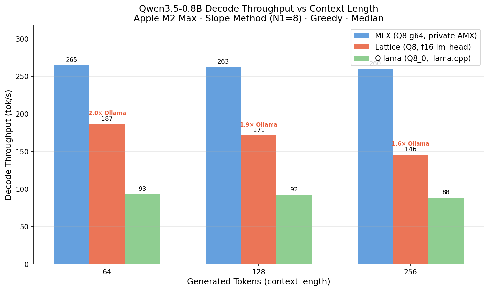

# Lattice

Pure Rust inference engine for transformer models on Apple Silicon.

[](LICENSE)
[](https://crates.io/crates/lattice-embed)
[](https://github.com/ohdearquant/lattice/actions)

No ONNX. No Python. No CUDA. No external ML runtime. Lattice implements the full compute graph
— weight loading, tokenization, forward pass, and vector operations — in Rust, with hand-written
Metal shaders and SIMD kernels.



**Lattice is the only inference engine that correctly runs Qwen3.5's hybrid GatedDeltaNet architecture at 4-bit on Apple Silicon** — with QuaRot-Q4 and LoRA hot-swap that neither Ollama nor MLX support. On a fair end-to-end decode measurement it is **1.6–2.0× faster than Ollama/llama.cpp** depending on context length (187 vs 93 tok/s at 64 tokens; 146 vs 88 tok/s at 256 tokens). Apple's MLX (Metal-native, private AMX API) decodes faster than Lattice at raw throughput — Lattice's edge is portability (pure Rust, no Python/framework) plus those Q4 + adapter capabilities. Full table and methodology below.

```bash
# Reproduce on your hardware (macOS + ollama + uv):
./scripts/bench_apples_to_apples.sh
```

Built for inference on CPU and macOS GPU. Optimized for AVX2 (x86), NEON (ARM),
and Metal (Apple Silicon) — not CUDA. If you need NVIDIA GPU inference, use
[candle](https://github.com/huggingface/candle) or [mistral.rs](https://github.com/EricLBuehler/mistral.rs).
Lattice targets the other 90% of deployments: servers, edge, laptops, and library dependencies
that shouldn't drag in a 300 MB ONNX runtime.

---

## Quick Start

```toml
[dependencies]
lattice-embed = "0.3"
tokio = { version = "1", features = ["full"] }
```

```rust
use lattice_embed::{EmbeddingService, EmbeddingModel, NativeEmbeddingService};

#[tokio::main]
async fn main() -> Result<(), Box<dyn std::error::Error>> {
    let service = NativeEmbeddingService::default();

    // Single embedding (BGE-small-en-v1.5, 384 dimensions)
    let embedding = service
        .embed_one("The quick brown fox jumps over the lazy dog", EmbeddingModel::default())
        .await?;

    println!("Dimensions: {}", embedding.len()); // 384

    // Batch
    let texts = vec![
        "First document".to_string(),
        "Second document".to_string(),
    ];
    let embeddings = service.embed(&texts, EmbeddingModel::BgeSmallEnV15).await?;

    // SIMD-accelerated similarity
    let similarity = lattice_embed::utils::cosine_similarity(&embeddings[0], &embeddings[1]);
    println!("Similarity: {:.4}", similarity);

    Ok(())
}
```

Model weights are downloaded from HuggingFace on first use and cached at `~/.lattice/models`
(or `$LATTICE_MODEL_CACHE`).

---

## Features

| Feature                    | Description                                                                                                                                                                     |
| -------------------------- | ------------------------------------------------------------------------------------------------------------------------------------------------------------------------------- |
| Pure Rust compute          | Hand-written SIMD kernels (AVX2/NEON). No C++, no ONNX, no CUDA.                                                                                                                |
| Multiple model families    | BERT/BGE encoder (CLS pooling), E5/MiniLM encoder (mean pooling), Qwen3 decoder embedding, Qwen3.5/3.6 generation, CrossEncoder reranker — see [docs/models.md](docs/models.md) |
| 9 local embedding models   | BGE, mE5, MiniLM, Qwen3-Embedding families — full support matrix: [docs/models.md](docs/models.md)                                                                              |
| Metal GPU backend          | Native Apple Silicon acceleration via Metal MSL shaders. WGPU fallback for cross-platform.                                                                                      |
| Three pure Rust tokenizers | WordPiece, SentencePiece, BPE — no Hugging Face tokenizers C extension                                                                                                          |
| Safetensors native         | Memory-mapped weight loading from HuggingFace `.safetensors` format                                                                                                             |
| MRL support                | Matryoshka truncation for Qwen3 models (configurable output dimension >= 32)                                                                                                    |
| LRU embedding cache        | `CachedEmbeddingService` with sharded in-memory cache and hit/miss stats                                                                                                        |
| LoRA adapter injection     | Inference hook, `Qwen35Model::set_lora`, `lattice-tune` PEFT safetensors, Metal single-adapter path — see [docs/models.md §3](docs/models.md#3-inference-features)              |
| Knowledge distillation     | Train small models from Claude/GPT/Gemini teacher soft labels                                                                                                                   |
| Optimal transport          | Sinkhorn-Knopp solver (log-domain, epsilon-scaling) for embedding drift detection                                                                                               |
| Tiny fast networks         | `lattice-fann`: sub-5ms classifiers with pre-allocated buffers, zero-alloc forward pass                                                                                         |

---

## Architecture

```
Application
    |
    v
lattice-embed          (public API — embedding service, SIMD distance ops, LRU cache)
    |
    v
lattice-inference      (transformer kernel — BERT/Qwen3 forward pass, tokenizers, weights)
    |
    +---> CPU (primary)      Metal (macOS)     WGPU (fallback)
          AVX2/NEON kernels   Apple Silicon      Vulkan/DX12


lattice-fann           (standalone — tiny network primitives, <5ms CPU inference)
lattice-transport      (standalone — optimal transport math, Wasserstein distances)
lattice-tune           (depends on fann + inference — LoRA, distillation, model registry)
```

The three leaf crates (`inference`, `fann`, `transport`) have zero intra-workspace dependencies
and can be used standalone.

---

## Crates

| Crate                                    | Description                                                                                                                                                                    | LOC    |
| ---------------------------------------- | ------------------------------------------------------------------------------------------------------------------------------------------------------------------------------ | ------ |
| [`lattice-embed`](crates/embed/)         | Embedding service — `EmbeddingService` trait, `NativeEmbeddingService`, `CachedEmbeddingService`, SIMD cosine/dot/euclidean, backfill, migration                               | ~14 k  |
| [`lattice-inference`](crates/inference/) | Transformer kernel — safetensors loading, BERT/BGE/Qwen3 forward pass, WordPiece/SentencePiece/BPE tokenizers, Metal/WGPU backends, LoRA hooks, KV cache, speculative decoding | ~69 k  |
| [`lattice-fann`](crates/fann/)           | Fast neural network primitives — `NetworkBuilder`, pre-allocated layers, zero-alloc forward pass, backprop trainer, FANN binary format                                         | ~7.5 k |
| [`lattice-tune`](crates/tune/)           | Training infrastructure — knowledge distillation pipeline, dataset management, LoRA adapter management, model registry with semver lineage                                     | ~13 k  |
| [`lattice-transport`](crates/transport/) | Optimal transport math — Sinkhorn-Knopp (balanced + unbalanced), Wasserstein barycenters, embedding drift detection, log-domain throughout                                     | ~5.3 k |

---

## Supported Models

For the full support matrix — all embedding and generation models, attention variants, inference
features, and tokenizer details — see **[docs/models.md](docs/models.md)**.

Quick reference for the local embedding models available through `EmbeddingModel`:

| Variant                             | HuggingFace ID                                                | Dims  | Max tokens | Auto-download  |
| ----------------------------------- | ------------------------------------------------------------- | :---: | :--------: | :------------: |
| `BgeSmallEnV15`                     | `BAAI/bge-small-en-v1.5`                                      |  384  |    512     |       ✓        |
| `BgeBaseEnV15`                      | `BAAI/bge-base-en-v1.5`                                       |  768  |    512     |       ✓        |
| `BgeLargeEnV15`                     | `BAAI/bge-large-en-v1.5`                                      | 1024  |    512     |       ✓        |
| `MultilingualE5Small`               | `intfloat/multilingual-e5-small`                              |  384  |    512     |       ✓        |
| `MultilingualE5Base`                | `intfloat/multilingual-e5-base`                               |  768  |    512     |       ✓        |
| `AllMiniLmL6V2`                     | `sentence-transformers/all-MiniLM-L6-v2`                      |  384  |    256     |       ✓        |
| `ParaphraseMultilingualMiniLmL12V2` | `sentence-transformers/paraphrase-multilingual-MiniLM-L12-v2` |  384  |    128     |       ✓        |
| `Qwen3Embedding0_6B`                | `Qwen/Qwen3-Embedding-0.6B`                                   | 1024  |    8192    | local dir only |
| `Qwen3Embedding4B`                  | `Qwen/Qwen3-Embedding-4B`                                     | 2560† |    8192    | local dir only |

†Both Qwen3 embedding variants support MRL truncation to any dimension ≥ 32.
BGE v1.5 uses CLS pooling; E5 and MiniLM use mean pooling.
E5 `document_instruction()` returns `"passage: "` — `embed_passage()` applies it automatically.

---

## Selecting a Model

```rust
use lattice_embed::EmbeddingModel;

// Fast general-purpose English retrieval
let model = EmbeddingModel::BgeSmallEnV15;   // 384-dim, fastest

// Balanced quality/speed
let model = EmbeddingModel::BgeBaseEnV15;   // 768-dim

// Best quality, English
let model = EmbeddingModel::BgeLargeEnV15;  // 1024-dim

// Multilingual retrieval
let model = EmbeddingModel::MultilingualE5Base;  // 768-dim, 100+ languages

// Long context + multilingual (requires GPU for practical throughput)
let model = EmbeddingModel::Qwen3Embedding0_6B;  // 1024-dim, 8K context

// MRL: variable output dimension
use lattice_embed::ModelConfig;
let config = ModelConfig::try_new(EmbeddingModel::Qwen3Embedding4B, Some(512))?;
```

---

## Feature Flags

### lattice-embed

| Feature     | Default | Description                                 |
| ----------- | ------- | ------------------------------------------- |
| `native`    | yes     | Pure Rust inference via `lattice-inference` |
| `metal-gpu` | no      | Metal GPU acceleration (macOS)              |
| `avx512`    | no      | AVX-512 SIMD kernels (requires nightly)     |

### lattice-inference

| Feature     | Default | Description                                            |
| ----------- | ------- | ------------------------------------------------------ |
| `f16`       | no      | Half-precision weights                                 |
| `metal-gpu` | no      | Metal compute backend                                  |
| `wgpu-gpu`  | no      | WGPU cross-platform GPU backend                        |
| `download`  | yes     | HuggingFace weight download with checksum verification |
| `backfill`  | no      | Re-embedding coordinator (requires `rusqlite`)         |

```toml
# GPU acceleration on macOS
lattice-embed = { version = "0.1", features = ["metal-gpu"] }

# Cross-platform GPU
lattice-embed = { version = "0.1", features = ["wgpu-gpu"] }
```

---

## Vector Operations

`lattice-embed` exposes SIMD-accelerated vector utilities as a stable public API:

```rust
use lattice_embed::utils;

// Runtime dispatch: AVX2 on x86_64, NEON on aarch64, scalar fallback elsewhere
let sim = utils::cosine_similarity(&a, &b);
let dot = utils::dot_product(&a, &b);
let dist = utils::euclidean_distance(&a, &b);

utils::normalize(&mut vector);  // in-place L2 normalization

// Batch operations
let sims = utils::batch_cosine_similarity(&pairs);
```

Measured performance on normalized 384-dim vectors (internal benchmarks, subject to hardware):

| Operation                    | Scalar   | SIMD    |
| ---------------------------- | -------- | ------- |
| cosine similarity (384-dim)  | ~650 ns  | ~90 ns  |
| cosine similarity (768-dim)  | ~1300 ns | ~180 ns |
| cosine similarity (1024-dim) | ~1700 ns | ~240 ns |

---

## lattice-fann: Fast Neural Networks

For tiny classifiers that need to run in under 5 ms on CPU:

```rust
use lattice_fann::{NetworkBuilder, Activation, BackpropTrainer, TrainingConfig, Trainer};

// Build a network
let mut network = NetworkBuilder::new()
    .input(784)
    .hidden(128, Activation::ReLU)
    .hidden(64, Activation::ReLU)
    .output(10, Activation::Softmax)
    .build()?;

println!("{}", network.architecture()); // "784 -> ReLU(128) -> ReLU(64) -> Softmax(10)"
println!("Parameters: {}", network.total_params());

// Forward pass (no heap allocation)
let output = network.forward(&input)?;

// Serialize to compact binary (magic "FANN")
let bytes = network.to_bytes();
let restored = lattice_fann::Network::from_bytes(&bytes)?;
```

---

## lattice-transport: Optimal Transport

Entropy-regularized optimal transport for measuring embedding geometry drift:

```rust
// Sinkhorn-Knopp in log-domain (numerically stable, no Gibbs kernel materialization)
// Balanced OT, unbalanced OT (KL-relaxed), Wasserstein barycenters
// Pre-allocated SinkhornWorkspace for zero-alloc inner loops
```

Primary use case: detect when an embedding model update has shifted the distribution of stored
vectors enough to warrant re-indexing.

---

## Benchmarks

### Qwen3.5-0.8B Decode Throughput (Apple M2 Max)

Fair end-to-end measurement — **slope method**: `tok/s = (N₂−N₁) / (T(N₂)−T(N₁))` for a fixed
prompt, so prompt prefill, model load, and per-call overhead cancel and every engine is measured
the _same_ way (greedy, median of 5 runs).

| Context | Lattice (Q8, f16 head) | Ollama (Q8_0) | MLX (Q8 g64, AMX) | Lattice vs Ollama |
| ------- | ---------------------- | ------------- | ------------------ | ----------------- |
| 64 tok  | **187**                | 93            | 265                | **2.0×**          |
| 128 tok | **171**                | 92            | 263                | **1.9×**          |
| 256 tok | **146**                | 88            | 260                | **1.6×**          |

MLX uses Apple's private MPS/AMX matrix engines — a different category than public-Metal-compute
engines (Lattice, Ollama). **MLX decodes faster than Lattice.** Lattice's value is portability
plus capabilities no other engine has on this model:

| Lattice-only capability            | MLX | Ollama |
| ---------------------------------- | --- | ------ |
| QuaRot 4-bit (rotated quant)       | ✗   | ✗      |
| Q4 + LoRA r8 hot-swap (no reload)  | ✗   | ✗      |
| Pure Rust, zero Python / framework | ✗   | ✗      |

All three engines implement the full GDN recurrence for Qwen3.5's hybrid architecture
(18 GatedDeltaNet + 6 GQA layers). PPL parity confirmed: Lattice 20.60 vs MLX 20.67 on
wikitext-2 (2048 tokens). Reproducible via `./scripts/bench_context_scaling.sh`.

### Embedding & Kernel Benchmarks

```bash
# Embedding throughput
cargo bench --package lattice-embed

# Metal GPU decode (macOS only, requires model weights)
cargo bench -p lattice-inference --features metal-gpu,f16 -- metal_decode

# Attention kernel
cargo bench --package lattice-inference --bench attention_bench
```

Performance depends on hardware, model size, batch size, and sequence length. Run the benchmarks
on your target hardware to get representative numbers.

---

## Documentation

- [Architecture](docs/architecture.md) — crate dependency graph, design decisions, stability tiers
- ADR directory: `docs/adr/` — architectural decision records

---

## License

Apache-2.0. See [LICENSE](LICENSE).

---

Built by [Ocean (HaiyangLi)](https://github.com/ohdearquant). Powers
[khive](https://khive.ai), a cognitive infrastructure for AI agents.
